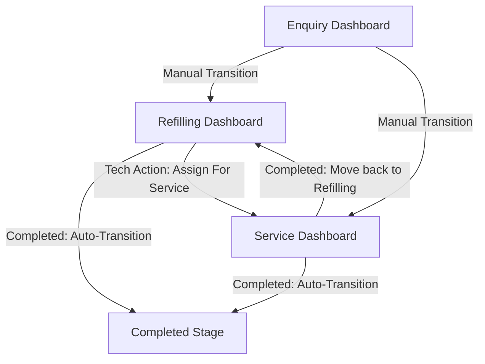

# Application Flow & Screens View Reference Guide

This document explains the functional architecture of the Safeway Enquiry Management System (EMS). It details the lifecycle flow of a ticket and guides users through the layout, actions, and features of each dashboard screen.

---

## 🗺️ 1. The Global Application Flow

A work order in the system is represented by a **Ticket**. The ticket moves dynamically through the system stages based on manual actions from the Admin or automated actions completed by technicians in the field.

### Transition Triggers

1. **ENQUIRY $\rightarrow$ REFILLING or SERVICES (Manual)**
   * **Trigger**: Admin verifies the quote/purchase order and moves the ticket.
   * **Action**: Handled via the **Bulk Transition** menu or the **Edit Ticket** modal.
2. **REFILLING $\rightarrow$ SERVICES (Automatic)**
   * **Trigger**: Technician arrives to refill but identifies a faulty component (leaking valve, cracked seal, expired pressure shell).
   * **Action**: Technician selects status **`Assign For Service`** in their task portal. The ticket automatically leaves the Refilling dashboard and appears in the Service dashboard.
3. **REFILLING / SERVICES $\rightarrow$ COMPLETED (Automatic)**
   * **Trigger**: Technician completes gas weight entry or parts replacement.
   * **Action**: Technician selects status **`Completed`**. The ticket moves to the archive list, delivered dates are logged, and next year's AMC expiration is automatically calculated.

---

## 📺 2. Screen-by-Screen Guide

The system features 5 core pages designed for back-office administrators and field technicians.

---

### A. Enquiry Dashboard Screen (`/admin/enquiry`)
This is the entry queue where leads, inspections, and new quotes are registered.

* **Main Grid Columns:**
  * `S.No` / `Enquiry ID` (e.g. `EQ001`)
  * `Client Name` / `Contact Person` / `Contact Number`
  * `Source` (e.g. Walk-in, Website)
  * `Requirement Category` (e.g. New Extinguisher, Refilling, CCTV)
  * `Registered On` (Creation timestamp)
  * `Actions` (Edit, Assign Technician, Delete)
* **Status Milestones (`Enquiry Status`):**
  * `Enquiry Received`
  * `Quotation Sent`
  * `Follow-up in Progress`
  * `Order Confirmed`
  * `Order Delivered`
  * `Order Dropped`
  * `Not Interested`
  * `Could not reach the customer`
* **Core Modals & Controls:**
  * **Add Enquiry Modal:** Manually capture company name, primary phone, email, delivery request dates, and requirement category.
  * **CSV Bulk Import:** Upload legacy database spreadsheets. Custom mapping algorithms automatically map phone numbers and names.
  * **Assign Technician Dialog:** Select one or more technicians, log administrative notes (`adminNotes`), and schedule visit dates.

---

### B. Refilling Dashboard Screen (`/admin/refilling`)
Designed specifically to track cylinders sent to the plant for gas refilling.

* **Main Grid Columns:**
  * `S.No` / `Job Number`
  * `Cylinder Serial Number` (Unique barcode/cylinder tag)
  * `Extinguisher Type` (e.g., CO2, DCP, Foam, Water)
  * `Capacity` (e.g., 2 Kg, 9 Kg)
  * `Stage Status` (e.g. "Refilling Order Received", "Filled & Validated")
  * `Actions` (Record weights, Assign dispatches)
* **Status Milestones (`Current Year Refilling Status`):**
  * `Refilling Order Received`
  * `Quotation Sent`
  * `Follow-up in Progress`
  * `Order Confirmed`
  * `Order Delivered`
  * `Order Dropped`
  * `Not Interested`
  * `Could not reach the customer`
* **Weights & Safety Inputs:**
  * **Hydrostatic Pressure Test Check:** A binary checklist field verifying the cylinder shell has passed pressure safety thresholds.
  * **Gas Weights:** Inputs to log `Tare Weight` (empty weight), `Refilled Gas Qty (kg)` (weight of gas filled), and `Gross Weight` (total filled weight). The system validates that Gross = Tare + Refilled.

---

### C. Service Dashboard Screen (`/admin/services`)
Manages repair works, parts replacements, and general inspections.

* **Main Grid Columns:**
  * `S.No` / `Ticket Number`
  * `Client Name`
  * `Assigned Techs`
  * `Service Type` (e.g., Hydrotesting, Valve Replaced, Safety Pin Replaced)
  * `Scheduled On` (Target repair date)
* **Core Inputs:**
  * **Parts Replaced Checklist:** Multi-select options (`Valve`, `Pressure Gauge`, `Discharge Hose`, `Squeeze Handle`). Logs inventory usage.
  * **Next Service Due Date:** Automatically sets up reminder intervals.

---

### D. Technician View Screen (Admin Dashboard - `/admin/tasks`)
Allows the Admin to track dispatches, technician positions, and completed statuses in real-time.

* **Main Grid Columns:**
  * `S.No`
  * `Client Name`
  * `Contact Number`
  * `Employee Name` (The dispatched technician)
  * `Completed Status` (`Pending`, `Completed`, `Assign For Service`)
  * `Assignment Type` (`ENQUIRY`, `REFILLING`, `SERVICE`)
  * `Customer Location` (Clickable "View Location" link opening maps)
  * `Assigned On` (Scheduled date)
* **Actions:**
  * **Edit Task View Modal:** Admins can view complete technician instructions, read notes returned by the technician, or manually force-change the task status.

---

### E. Technician Portal (Field View - `/technician/tasks`)
A mobile-responsive portal designed for field staff.

* **Key Features:**
  * **Row-Level Security:** Technicians only see dispatches assigned specifically to them.
  * **One-Click Location Routing:** Click "View Location" to open directions in Google Maps immediately.
  * **Task Execution Drawer:** Open tasks to review client requirements, log post-service notes (`notes`), input weight parameters, and update the completed status.
