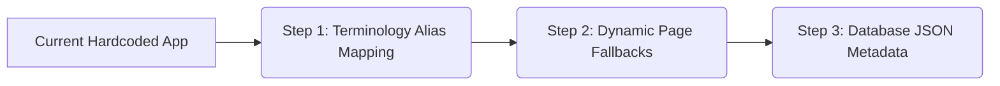

# Backward-Compatible Migration Plan: Multi-Tenant Expansion

This plan outlines how to transition the application into a multi-domain platform **without deleting existing database columns, changing current dashboard URLs, or disrupting your first client (Safeway Fire Protection)**.

---

## 🔒 The Rule of Zero-Disruption
To protect your first client:
1. **Zero Database Schema Depletions**: We keep columns like `serialNumber`, `capacity`, `extinguisherType`, `amcYears`, and `amcDate` in the SQLite database.
2. **Default Configurations**: The static filesystem configuration (`EMS_CONFIG` in `ems-config.ts`) remains configured for the Fire Safety domain. Any tenant without a custom DB config will fall back to this automatically.
3. **Preserving Dashboard Pages**: We keep `/admin/enquiry`, `/admin/refilling`, and `/admin/services` exactly as they are.

---

## 🛠️ Step-by-Step Transition Strategy

### Step 1: Virtual Terminology Alias Mapping (No Column Deletion)
We do not delete database columns. Instead, we rename how they appear in the UI for other domains.

* **Client 1 (Safeway - Fire Safety)**:
  - Database column `serialNumber` ➔ Rendered in UI as `"Cylinder Tag / Serial No"`
  - Database column `capacity` ➔ Rendered in UI as `"Cylinder Capacity"`
* **Client 2 (Arctic Cold - HVAC)**:
  - Database column `serialNumber` ➔ Rendered in UI as `"AC Compressor Serial Number"`
  - Database column `capacity` ➔ Rendered in UI as `"AC Tonnage (HP)"`

*For both clients, the database stores the values in `serialNumber` and `capacity` columns. Only the display label changes!*

---

### Step 2: Keeping Dashboard Pages Intact (Graceful Redirects)
To prevent changing the URLs that your first client is already using:

1. Keep the routes `/admin/enquiry`, `/admin/refilling`, and `/admin/services`.
2. Update the sidebar navigation. It reads the tenant's configuration.
   - For **Client 1**, all three stages are active, so the sidebar renders:
     - `Enquiry Dashboard` ➔ links to `/admin/enquiry`
     - `Refilling Dashboard` ➔ links to `/admin/refilling`
     - `Services Dashboard` ➔ links to `/admin/services`
   - For a new **Client 2 (HVAC)** who does not have a "Refilling" stage:
     - The configuration disables `REFILLING`.
     - The sidebar only renders links to `Enquiry` and `Services` dashboards.

---

### Step 3: Custom Checklist Isolation via JSON
* **First Client (Safeway)**:
  - Continues using the hardcoded refilling checklist (`pressureTestPassed`, `tareWeight`, `grossWeight`) saved in `stageData`.
* **New Clients (e.g. HVAC, Cleaning)**:
  - Their check-in forms are rendered dynamically from the fields list inside their `SystemConfig` record. Their inputs are saved inside the `stageData` JSON column (which supports any structure, preventing schema conflicts).

---

## 🚀 Why this is Safe
- **100% Backward Compatible**: Your first client's database rows remain untouched. Their dashboard screens and URLs remain exactly the same.
- **No Data Migration Needed**: You do not have to write complex database migration scripts that could risk deleting or corrupting your first client's active jobs.
- **Seamless SaaS Onboarding**: When you sign a second client, you simply register a new `Tenant` record, define their custom label overrides in `SystemConfig`, and toggle off any stages they don't need in the sidebar.
