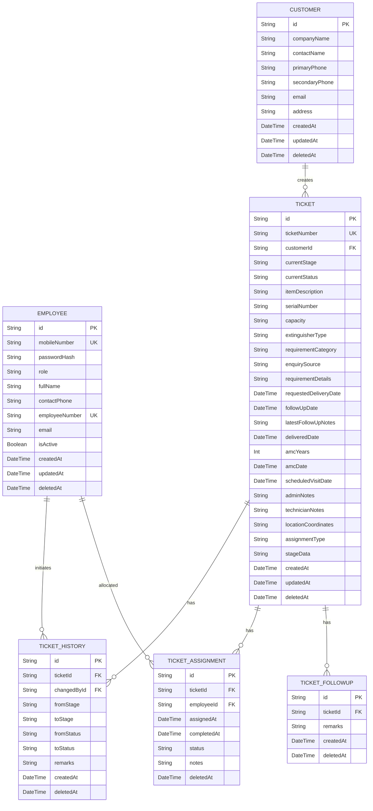

# Safeway EMS: Database Design & Soft Delete Specification

This document details the redesigned, client-agnostic database architecture, global naming conventions, and the soft-delete mechanism implemented for the **Enquiry Management System (EMS)**. 

---

## 1. Core Architectural Goals
To ensure the system can be white-labeled and scaled for multiple clients:
* **Generic Naming:** Specific business terms are replaced with universal entities (e.g. `User` -> `Employee`, `Job` -> `Ticket`).
* **Data Recovery Protection:** Every table contains a `deletedAt` timestamp column to facilitate soft deletes and prevent permanent data loss.
* **Query Automation:** The database client transparently handles soft-delete filtering so developers don't have to manually check `deletedAt: null` on every query.

---

## 2. Entity Relationship Diagram
The relations between the database models are structured as follows:



---

## 3. Database Table Structures

### A. Employee Table
Manages user accounts, roles, credentials, and contact details.

| Column | Type | Constraints / Attributes | Description | Example |
| :--- | :--- | :--- | :--- | :--- |
| **id** | String | `@id`, `@default(uuid())` | Unique identifier for the account | `d4b8e3a2-7f12-4c8d-b9ea-b65f3fcd84c6` |
| **mobileNumber** | String | `@unique`, Required | Mobile number used for logging in | `9876543210` |
| **passwordHash** | String | Required | Bcrypt hash of user's password | `$2a$10$X7jX8L2...` |
| **role** | String | Required | Role of user: `"ADMIN"` or `"TECHNICIAN"` | `ADMIN` |
| **fullName** | String | Optional | Display name of employee | `John Doe` |
| **contactPhone** | String | Optional | Secondary contact number | `9111111111` |
| **employeeNumber**| String | `@unique`, Optional | Unique employee code | `E001` |
| **email** | String | Optional | Employee email address | `john.doe@safeway.com` |
| **isActive** | Boolean | `@default(true)` | Facilitates instant account suspension | `true` |
| **createdAt** | DateTime | `@default(now())` | Creation date | `2026-07-14T10:00:00Z` |
| **updatedAt** | DateTime | `@updatedAt` | Automatic update timestamp | `2026-07-14T10:45:00Z` |
| **deletedAt** | DateTime | Optional | Timestamp for soft deletion | `null` |

---

### B. Customer Table
Manages clients placing service tickets.

| Column | Type | Constraints / Attributes | Description | Example |
| :--- | :--- | :--- | :--- | :--- |
| **id** | String | `@id`, `@default(uuid())` | Unique identifier for customer | `f9b5c3e4-8a12-4d8b-b9f1-a75d3fcd84c2` |
| **companyName** | String | Optional | Customer's business/company name | `KH Chemicals` |
| **contactName** | String | Required | Primary contact person name | `Karamad Begum` |
| **primaryPhone** | String | Required | Main contact phone number | `9840135355` |
| **secondaryPhone**| String | Optional | Secondary phone number | `9840135356` |
| **email** | String | Optional | Primary email address | `karamad@khchem.com` |
| **address** | String | Optional | Physical location address | `Adyar, Chennai` |
| **createdAt** | DateTime | `@default(now())` | Creation date | `2026-07-14T10:00:00Z` |
| **updatedAt** | DateTime | `@updatedAt` | Last update date | `2026-07-14T10:45:00Z` |
| **deletedAt** | DateTime | Optional | Timestamp for soft deletion | `null` |

---

### C. Ticket Table
Tracks enquiries and service lifecycles.

| Column | Type | Constraints / Attributes | Description | Example |
| :--- | :--- | :--- | :--- | :--- |
| **id** | String | `@id`, `@default(uuid())` | Unique identifier for the ticket | `a1b2c3d4-e5f6-7a8b-9c0d-1e2f3a4b5c6d` |
| **ticketNumber** | String | `@unique`, Required | Autogenerated unique reference code | `EQ001` |
| **customerId** | String | Optional, `FK(Customer.id)` | Link to customer record | `f9b5c3e4-8a12-4d8b-b9f1-a75d3fcd84c2` |
| **currentStage** | String | Required | Pipeline stage: `"ENQUIRY"`, `"REFILLING"`, `"SERVICES"` | `ENQUIRY` |
| **currentStatus** | String | Required | Status detail (e.g. `"Order Delivered"`, `"Pending"`) | `Order Delivered` |
| **itemDescription**| String | Optional | Description of cylinder or site assets | `ABC Fire Extinguisher 9kg` |
| **serialNumber** | String | Optional | Cylinder barcode/cylinder tag number | `CYL-99823` |
| **capacity** | String | Optional | Size weight capacity (e.g. `"9 Kg"`) | `9 Kg` |
| **extinguisherType**| String| Optional | Asset type (e.g. `"CO2"`, `"DCP"`) | `DCP` |
| **requirementCategory**| String| Optional| Work category (e.g. `"CCTV"`, `"Refilling"`) | `Refilling` |
| **enquirySource** | String | Optional | Lead source (e.g. `"Walk-in"`, `"Social Media"`) | `Social Media` |
| **requirementDetails**| String| Optional| Details of what client requests | `Refill 4 DCP cylinders` |
| **requestedDeliveryDate**| DateTime| Optional| Customer delivery date | `2026-07-20T10:00:00Z` |
| **followUpDate** | DateTime | Optional | Scheduled follow-up date | `2026-07-16T12:00:00Z` |
| **latestFollowUpNotes**| String| Optional| Latest follow-up notes | `Wants a quotation` |
| **deliveredDate** | DateTime | Optional | Delivery confirmation timestamp | `2026-07-15T15:30:00Z` |
| **amcYears** | Int | Optional | Years of AMC coverage | `2` |
| **amcDate** | DateTime | Optional | Calculated AMC expiry date | `2028-07-15T15:30:00Z` |
| **scheduledVisitDate**| DateTime| Optional| Date of technician visit | `2026-07-15T09:00:00Z` |
| **adminNotes** | String | Optional | Instructions logged by back-office staff | `Verify pressure gauge` |
| **technicianNotes**| String | Optional | Report comments logged by technician | `Valve was replaced` |
| **locationCoordinates**| String| Optional| Map URL or coordinates | `https://maps.google.com/?q=12,80` |
| **assignmentType**| String | Optional, `default("DELIVERY")`| Purpose of technician assignment | `DELIVERY` |
| **stageData** | String | Optional | Serialized dynamic fields JSON doc | `{"pressureTestPassed":true}` |
| **createdAt** | DateTime | `@default(now())` | Timestamp of ticket creation | `2026-07-14T10:00:00Z` |
| **updatedAt** | DateTime | `@updatedAt` | Automatic update timestamp | `2026-07-14T10:45:00Z` |
| **deletedAt** | DateTime | Optional | Timestamp for soft deletion | `null` |

---

### D. TicketFollowUp Table
Logs sequential records of follow-up remarks on enquiries.

| Column | Type | Constraints / Attributes | Description | Example |
| :--- | :--- | :--- | :--- | :--- |
| **id** | String | `@id`, `@default(uuid())` | Unique ID for follow-up record | `c2b3a4d5-e6f7-7a8b-9c0d-1e2f3a4b5c6d` |
| **ticketId** | String | Required, `FK(Ticket.id)` with cascade delete | Associated ticket ID | `a1b2c3d4-e5f6-7a8b-9c0d-1e2f3a4b5c6d` |
| **remarks** | String | Required | Notes from follow-up conversation | `Client approved pricing` |
| **createdAt** | DateTime | `@default(now())` | Entry creation date | `2026-07-14T11:00:00Z` |
| **deletedAt** | DateTime | Optional | Timestamp for soft deletion | `null` |

---

### E. TicketAssignment Table
Allocates technicians to specific service requests.

| Column | Type | Constraints / Attributes | Description | Example |
| :--- | :--- | :--- | :--- | :--- |
| **id** | String | `@id`, `@default(uuid())` | Unique assignment ID | `z1y2x3w4-v5u6-7t8s-9r0q-1p2o3n4m5l6k` |
| **ticketId** | String | Required, `FK(Ticket.id)` with cascade delete | Associated ticket ID | `a1b2c3d4-e5f6-7a8b-9c0d-1e2f3a4b5c6d` |
| **employeeId** | String | Required, `FK(Employee.id)` | Allocated employee/technician ID | `d4b8e3a2-7f12-4c8d-b9ea-b65f3fcd84c6` |
| **assignedAt** | DateTime | `@default(now())` | Time of assignment | `2026-07-14T10:15:00Z` |
| **completedAt** | DateTime | Optional | Time technician finished assignment | `2026-07-14T14:30:00Z` |
| **status** | String | Required | Task status: `"Pending"`, `"Completed"`, or `"Assign For Service"` (dynamic based on `assignmentType`) | `Pending` |
| **notes** | String | Optional | Technician post-service comments | `Valve seal verified ok` |
| **deletedAt** | DateTime | Optional | Soft-delete timestamp | `null` |

> [!NOTE]
> **Dynamic Status Mappings:**
> * For `assignmentType` of `ENQUIRY` or `SERVICE`, `status` options are restricted to: `Pending`, `Completed`.
> * For `assignmentType` of `REFILLING`, an additional option is available: `Assign For Service` (used when technicians note that a cylinder fails visual inspection and must be scheduled for a pressure test or parts service).

*Note: Contains unique constraint `[ticketId, employeeId]` to enforce unique single technician-to-ticket mappings.*

---

### F. TicketHistory Table
Chronological log of ticket state changes.

| Column | Type | Constraints / Attributes | Description | Example |
| :--- | :--- | :--- | :--- | :--- |
| **id** | String | `@id`, `@default(uuid())` | Unique history log ID | `h1i2j3k4-l5m6-7n8o-9p0q-1r2s3t4u5v6w` |
| **ticketId** | String | Required, `FK(Ticket.id)` with cascade delete | Associated ticket ID | `a1b2c3d4-e5f6-7a8b-9c0d-1e2f3a4b5c6d` |
| **changedById** | String | Required, `FK(Employee.id)` | User ID who made the change | `d4b8e3a2-7f12-4c8d-b9ea-b65f3fcd84c6` |
| **fromStage** | String | Optional | Ticket stage before modification | `ENQUIRY` |
| **toStage** | String | Optional | Ticket stage after modification | `REFILLING` |
| **fromStatus** | String | Optional | Ticket status before modification | `Order Delivered` |
| **toStatus** | String | Optional | Ticket status after modification | `Refilling Order Received` |
| **remarks** | String | Optional | Context details on transition trigger | `Stage transitioned by Admin` |
| **createdAt** | DateTime | `@default(now())` | Transition log date | `2026-07-14T10:45:00Z` |
| **deletedAt** | DateTime | Optional | Soft-delete timestamp | `null` |

---

## 4. Automatic Soft Delete Implementation

The soft-delete mechanism relies on a Custom Prisma Client Extension. This removes the overhead of manual query filters.

### Implementation Pattern (`src/lib/db.ts`)
```typescript
import { PrismaClient } from "@prisma/client";

export const prisma = new PrismaClient().$extends({
  query: {
    $allModels: {
      // 1. Transparent Filtering: Intercept select operations to ignore soft-deleted items
      async findMany({ args, query }) {
        args.where = { deletedAt: null, ...args.where };
        return query(args);
      },
      async findFirst({ args, query }) {
        args.where = { deletedAt: null, ...args.where };
        return query(args);
      },
      async count({ args, query }) {
        args.where = { deletedAt: null, ...args.where };
        return query(args);
      },
      async update({ args, query }) {
        args.where = { deletedAt: null, ...args.where };
        return query(args);
      },
      async updateMany({ args, query }) {
        args.where = { deletedAt: null, ...args.where };
        return query(args);
      },
      
      // 2. Override Deletes: Convert hard delete operations into updates of deletedAt
      async delete({ args, query }) {
        args.data = { deletedAt: new Date() };
        return (query as any)({ ...args, operation: 'update' });
      },
      async deleteMany({ args, query }) {
        args.data = { deletedAt: new Date() };
        return (query as any)({ ...args, operation: 'updateMany' });
      }
    }
  }
});
```
This ensures compatibility across other models and white-labeled applications with zero change to standard client-side querying syntax (e.g., calling `prisma.ticket.delete(...)` executes a safe soft-delete transaction automatically).
