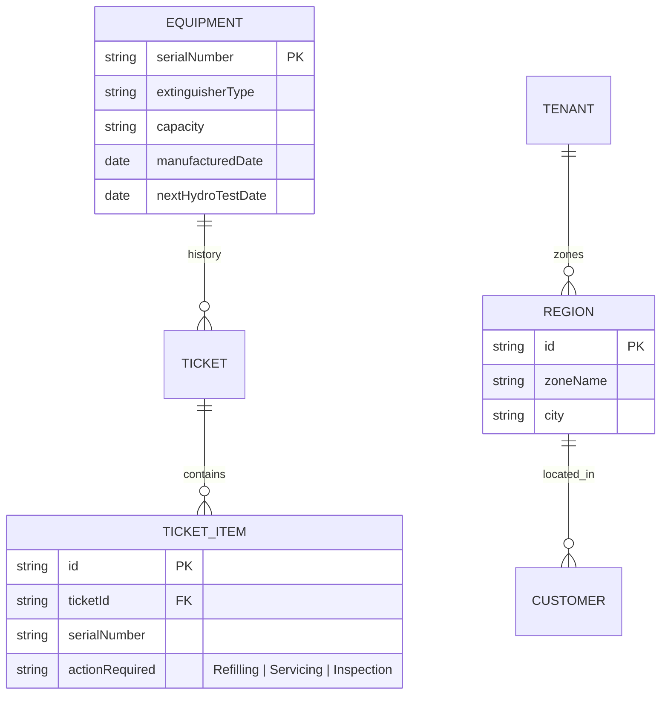

# Database & Schema Analysis: Proposing Next-Generation Features and Insights

Based on a detailed analysis of the Prisma database schema ([schema.prisma](file:///c:/Users/Guvi/Desktop/PW/EMS/prisma/schema.prisma)), the application is structured with a robust multi-tenant foundation. Below is a comprehensive list of actionable features, operational enhancements, and business insights that can be built upon the existing database models.

---

## 📊 1. Business Insights & Analytics Dashboards

With the current schema, we can run aggregate queries to extract high-value business intelligence:

### A. AMC Expiry & Renewal Forecasting Pipeline
* **Data Fields Used**: `Ticket.amcDate`, `Ticket.amcYears`, `Ticket.deliveredDate`, `Customer.primaryPhone`, `Customer.email`
* **Concept**: A dedicated dashboard for the sales team highlighting contracts nearing expiration.
* **Feature**:
  - Filter cylinders/contracts expiring in the next `15`, `30`, or `60` days.
  - Automatically calculate renewal quotes based on previous order details.
  - One-click button to send SMS/WhatsApp AMC renewal links.

### B. Cylinder Lifespan & Hydro-Test Scheduling
* **Data Fields Used**: `Ticket.serialNumber`, `Ticket.deliveredDate`, `Ticket.extinguisherType`
* **Concept**: Under fire safety regulations, fire cylinders must undergo hydro-static pressure testing (typically every 5 years) to verify structural integrity.
* **Feature**:
  - Query all unique `serialNumber` cylinders that were delivered 4–5 years ago.
  - Flag these cylinders on a "Hydro-Testing Schedule" panel so technicians can retrieve and test them when doing routine refilling.
  - Track complete cylinder lifecycle history across multiple independent tickets using the `serialNumber` as a tracking key.

### C. Technician Performance Leaderboard
* **Data Fields Used**: `TicketAssignment.assignedAt`, `TicketAssignment.completedAt`, `TicketAssignment.status`, `TicketHistory`
* **Concept**: Real-time operations efficiency dashboard.
* **Metrics**:
  - **Mean Time to Resolution (MTTR)**: Average time elapsed between `assignedAt` and `completedAt`.
  - **First-Time Fix Rate**: Percentage of jobs resolved by the first assigned technician without requiring re-assignment or stage-backtracking.
  - **Volume Leaderboard**: Active count of completed tasks per week/month.

### D. Lead Conversion & Enquiry Source Attribution
* **Data Fields Used**: `Ticket.currentStage`, `Ticket.enquirySource`, `Ticket.requirementCategory`, `Ticket.createdAt`
* **Concept**: Marketing and sales channel effectiveness analytics.
* **Metrics**:
  - Win/Loss ratio by `enquirySource` (e.g., checking how many "Social Media" vs. "Existing Customer" leads successfully progress from `ENQUIRY` stage to `COMPLETED`).
  - Popular demand distribution by `requirementCategory` (CCTV vs. Fire Safety) segmented by tenant.

---

## ⚙️ 2. Operational & Automation Enhancements

These features utilize existing data points to optimize workflows and reduce manual coordination:

### A. Location-Based Route Optimization
* **Data Fields Used**: `Ticket.locationCoordinates`, `Ticket.scheduledVisitDate`, `TicketAssignment`
* **Concept**: Technicians often travel to multiple job sites a day.
* **Feature**:
  - Use coordinates in the `locationCoordinates` field (lat/long string) to map active dispatches for a specific technician.
  - Re-order task sequences for the technician to follow the shortest path (Traveling Salesperson calculation), saving fuel and technician hours.
  - Show a dispatch map overlay to admins during scheduling to select the closest available technician.

### B. SLA Alerting & Idle Lead Escalation
* **Data Fields Used**: `Ticket.followUpDate`, `Ticket.updatedAt`, `TicketFollowUp`
* **Concept**: Prevent sales leads and urgent service tickets from falling through the cracks.
* **Feature**:
  - Flag enquiries that have been in the `ENQUIRY` stage with no active `TicketFollowUp` logs for more than 7 days.
  - Trigger email/system alerts to the admin when a `followUpDate` passes without status transitions.

### C. Interactive Custom Form Schema Builder
* **Data Fields Used**: `SystemConfig.config`, `Ticket.stageData`
* **Concept**: Different equipment types (e.g. CCTV vs. Fire Sprinkler vs. Gas Flooding) require different field verification forms (checklists, inspection sheets).
* **Feature**:
  - Allow administrators to configure dynamic custom fields inside the `SystemConfig` panel for different service categories.
  - Render these dynamically on the technician's phone during field verification using the `stageData` JSON field to store inspection results.

### D. Audit Compliance Log Viewer
* **Data Fields Used**: `TicketHistory`
* **Concept**: High-level managers want transparency regarding who changed records, especially in high-liability fire protection industries.
* **Feature**:
  - Render an interactive, chronological timeline showing every stage/status transition, status-update remarks, and the IP/employee identifier responsible.

---

## 🔮 3. Proposed Schema Adjustments (For Future Iterations)

To implement the advanced features above most effectively, we recommend adding a few relational tables to the schema over time:

1. **Equipment Master Table (`Equipment`)**: Extract `serialNumber`, `capacity`, and `extinguisherType` from individual tickets into a standalone equipment inventory. This tracks each physical cylinder's lifecycle, owner history, and inspection records independently of service tickets.
2. **Multi-Item Tickets (`TicketItem`)**: Currently, each ticket accommodates one equipment item. Splitting this allows a single customer ticket to support multiple cylinders (e.g., refilling 10 fire cylinders on a single work order).
3. **Region/Geofence Model (`Region`)**: Organize customers and technicians into service zones/regions to auto-assign incoming enquiries to the technician covering that specific sector.
