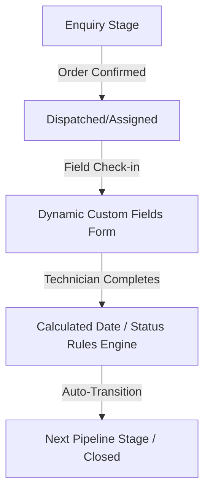

# Implementation Plan: Developer Control Panel & Multi-Domain System

This plan outlines the architecture, pipeline design, security controls, error-handling mechanisms, and instructions for building a production-grade **Developer Control Panel** to configure domain-agnostic Field Service Management (FSM) systems.

---

## 🔒 1. Developer Access & Control System

To securely isolate platform configuration from standard client admins, we establish a rigid Access Control Matrix.

```
                  ┌──────────────────────────────┐
                  │      DEVELOPER (Dev Console) │
                  │     (Role: SUPER_ADMIN)      │
                  └──────────────┬───────────────┘
                                 │
                   [Manages Global Configs & Tenant DBs]
                                 │
                                 ▼
                  ┌──────────────────────────────┐
                  │    CLIENT ADMIN (Subdomain)  │
                  │        (Role: ADMIN)         │
                  └──────────────┬───────────────┘
                                 │
                     [Manages Staff & Operations]
                                 │
                                 ▼
                  ┌──────────────────────────────┐
                  │     TECHNICIAN (Mobile app)  │
                  │      (Role: TECHNICIAN)      │
                  └──────────────────────────────┘
```

### Access Controls
* **Super-Admin/Developer Credentials**: Pre-seeded and restricted to internal development company email domains (e.g., `@devcompany.com`).
* **Session Claims**: Next.js auth cookies hold the `role` payload signed cryptographically (verified via signature matching).
* **API Middleware Guard**: Every management endpoint checks:
  ```typescript
  if (session.role !== "SUPER_ADMIN") return NextResponse.json({ error: "Access Denied" }, { status: 403 });
  ```

---

## ⚙️ 2. Dynamic Domain Fields (Custom Field Names)

To support multiple domains (e.g., HVAC, Fire Safety, Cleaning), we map static database columns to dynamic domain terms using a localized **Label Configuration Mapper**.

### Label Translation Map (Stored in `SystemConfig`)
The database schema remains rigid to maintain high search performance, but the UI translates labels based on the chosen domain:

| Database Column | Fire Safety Label | HVAC Label | IT Helpdesk Label |
| :--- | :--- | :--- | :--- |
| `serialNumber` | Cylinder Tag / Serial No | AC Compressor ID | Laptop Asset ID |
| `capacity` | Cylinder Capacity | AC Tonnage | RAM / Storage |
| `extinguisherType` | Extinguisher Type | Coolant Gas Type | Operating System |
| `visitDate` | Hydrotest / Visit Date | Service Date | Installation Date |
| `amcDate` | Next Refill Date | Next Maintenance Date | Next System Patch Date |

### Implementation Example (React Side)
```tsx
const labelMap = config.brand.labels;

return (
  <div className="grid">
    <div>
      <label>{labelMap?.serialNumber || "Equipment Serial"}</label>
      <input type="text" value={ticket.serialNumber} />
    </div>
    <div>
      <label>{labelMap?.capacity || "Size / Specs"}</label>
      <input type="text" value={ticket.capacity} />
    </div>
  </div>
);
```

---

## 🔄 3. Logs, Pipelines & Flow Dynamics

### Operational Pipeline
When a ticket moves between stages, it goes through a dynamic **State Transition Engine**:



### Audit Trail Logging
All changes to configurations, workflow stages, and ticket statuses must write to the `TicketHistory` or a new `SystemAuditLog` table.
* **Logging Payload**:
  - `action`: e.g., "Updated Category Fields for HVAC"
  - `actor`: `SUPER_ADMIN (Dev ID)`
  - `ip`: Request IP address
  - `beforeState` & `afterState`: JSON diff of changes

---

## 🚨 4. Error Handling & Validation Rules

To prevent misconfigurations from breaking the client UI or database transactions:

1. **Transaction Rollbacks**: All multi-stage transitions (e.g., task complete ➔ update ticket stage ➔ calculate next visit) must be wrapped inside a `prisma.$transaction` block. If one step fails, the entire transaction rolls back automatically.
2. **Configuration Validation Schema (Zod)**: When a developer edits domain settings, validate the JSON format before saving:
   ```typescript
   import { z } from "zod";
   
   const ConfigSchema = z.object({
     categories: z.array(z.string()),
     brand: z.object({
       title: z.string(),
       labels: z.object({
         serialNumber: z.string(),
         capacity: z.string(),
         extinguisherType: z.string(),
       })
     }),
     stages: z.record(z.object({
       enabled: z.boolean(),
       displayName: z.string(),
       fields: z.array(z.object({
         key: z.string(),
         label: z.string(),
         type: z.enum(["text", "number", "boolean", "select", "multi-select"]),
         options: z.array(z.string()).optional(),
         required: z.boolean().optional(),
       }))
     }))
   });
   ```
3. **Graceful Fallbacks**: If a label or stage field is missing in config, the frontend automatically falls back to system defaults instead of crashing.

---

## 🔒 5. Securities & Tenant Isolation Boundaries

Since the app is distributed as a multi-tenant SaaS, preventing cross-tenant data leaks is critical.

1. **Global Query Filters**:
   - Every database read/write query MUST filter by `tenantId`:
     ```typescript
     where: { id: ticketId, tenantId: session.tenantId }
     ```
   - Running raw database queries is forbidden; always scope through Prisma.
2. **Session Cookies Protection**:
   - Session cookies must use the flags: `HttpOnly`, `Secure` (HTTPS only), and `SameSite=Lax` to prevent XSS (Cross-Site Scripting) and CSRF (Cross-Site Request Forgery) attacks.
3. **Token Signatures**:
   - Signature checks prevent users from changing their session payloads to try to escalate their roles to `SUPER_ADMIN`.

---

## 🚀 6. Setup & Deployment Instructions

### A. Pre-Seeding Developer Account
To enable developer access on installation, create a seeding script `prisma/seed.ts` containing the initial `SUPER_ADMIN` developer profile:

```typescript
// prisma/seed.ts
import { PrismaClient } from "@prisma/client";
import bcrypt from "bcryptjs";

const prisma = new PrismaClient();

async function main() {
  const hashedPassword = await bcrypt.hash("DevSecurePassword2026!", 10);
  
  await prisma.employee.upsert({
    where: { mobileNumber: "9999999999" },
    update: {},
    create: {
      mobileNumber: "9999999999",
      passwordHash: hashedPassword,
      role: "SUPER_ADMIN",
      fullName: "Lead System Developer",
      employeeNumber: "DEV-001",
      email: "developer@devcompany.com",
    },
  });
  console.log("✅ Super Admin developer account seeded!");
}

main().finally(() => prisma.$disconnect());
```

### B. Accessing the Developer Control Panel
1. Deploy the app.
2. Run database migration and seeding commands:
   ```bash
   npx prisma db push
   npx prisma db seed
   ```
3. Log in with the pre-seeded credentials.
4. Route to `/admin/developer/config` (or the developer panel URL) to configure client workspaces.
