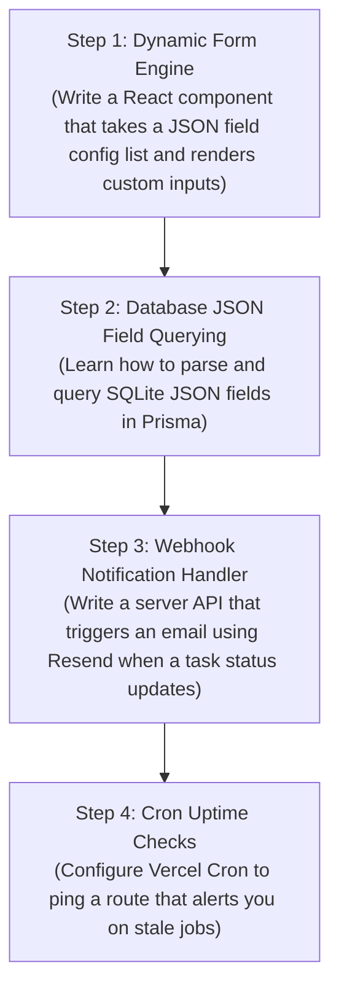

# 🛡️ Safeway EMS: Architectural Review, UI/UX & No-Code Playbook

This document provides a comprehensive review of the **Safeway Enquiry Management System (EMS)**. It evaluates the existing screens, details maintenance practices, recommends professional React packages, describes how to maintain the application's configuration-driven flexibility, and outlines a learning path for system design based on this architecture.

---

## 📺 1. Screen Verification & UI/UX Audit

The Safeway EMS currently includes 7 primary screen areas tailored for admins, technicians, and customers:

| Page / Screen | Path | Key Capabilities | Verification Status |
| :--- | :--- | :--- | :--- |
| **Login Screen** | `/` | Dual-pane layout, animated background blur, responsive form cards, automatic session recovery, and role-based redirecting. | ✅ Verified |
| **Admin Central Dashboard** | `/admin` | Real-time operations stats, executive telemetry, timeframe-based mock charts, active SLA metrics. | ✅ Verified |
| **Enquiry Dashboard** | `/admin/enquiry` | Client data tables, CSV bulk importing, automated header mapping, dynamic stage transitions, technician dispatching. | ✅ Verified |
| **Refilling Dashboard** | `/admin/refilling` | Cylinder serial tags, hydrostatic pressure testing validation, tare/gross weight validation controls. | ✅ Verified |
| **Service Dashboard** | `/admin/services` | AMC coverage, dynamic replacement parts checklists, scheduled technician visit registers. | ✅ Verified |
| **Technician Dispatch Board** | `/admin/tasks` | Live technician logs, technician feedback reports, clickable geolocation map routing. | ✅ Verified |
| **Technician Mobile Portal** | `/technician/tasks` | Role-isolated dispatch logs, mobile-optimized execution drawers, offline/online completion toggles. | ✅ Verified |

### 💡 Suggested UI/UX Enhancements

1. **Dynamic Kanban Board Toggle**:
   - **Why**: Admins managing enquiries or cylinder refilling prefer a card-based visual pipeline.
   - **How**: Add a view toggle button (`List` / `Kanban`) on the Enquiry, Refilling, and Service dashboards. Enable drag-and-drop mechanics to transition tickets between stages.
2. **True Interactive Chart Engine**:
   - **Why**: Currently, charts are rendered using calculated CSS div heights. While visually clean, they lack tooltips, zoom, and interactive legend clicks.
   - **How**: Integrate a responsive charting library to show dynamic trends (e.g. enquiries registered vs resolved).
3. **In-App Toast Alerts**:
   - **Why**: Users need instantaneous feedback (e.g., when a CSV import succeeds, or when weights fail validation).
   - **How**: Implement toast notification alerts that float unobtrusively in the corner of the viewport.
4. **Global Command Palette (`Ctrl + K`)**:
   - **Why**: High-efficiency admins waste time clicking through submenus to find specific cylinder serial numbers or client companies.
   - **How**: Add a search popover listing quick actions, search results, and navigation links.

---

## 🛠️ 2. Dev Maintenance Guide for Non-Coders

Maintaining a Next.js application when you are primarily a no-code/low-code developer can feel intimidating. Here are the easiest methods to manage this system without breaking the codebase:

### A. Prisma Studio: Your Visual Database Manager
Instead of writing complex SQL queries or editing databases through commands, use **Prisma Studio**. It converts your SQLite database into a clean, searchable spreadsheet in the browser.
- **How to run**: Open your terminal, navigate to the folder, and run:
  ```bash
  npx prisma studio
  ```
- **Use Case**: Search for specific records, update a customer's mistyped phone number, reset passwords, or delete duplicate test tickets.

### B. Leverage the Central Configuration File
Almost all labels, active stages, custom fields, and CSV upload options are driven by a single file: [ems-config.ts](file:///c:/Users/Guvi/Desktop/PW/EMS/src/config/ems-config.ts). 
- Changing options in this file will automatically rebuild the forms, filters, and tables. Avoid editing the underlying React page code directly.

### C. Utilize VS Code Extensions
Ensure you have the following extensions installed in Visual Studio Code:
1. **Prisma**: Adds color highlighting and auto-formatting to your database schema.
2. **Prettier - Code Formatter**: Automatically formats your typescript files on save, avoiding syntax compilation errors.

---

## 📦 3. Professional Packages to Optimize & Polish

To elevate the application's performance, design, and usability, consider adding these curated npm packages:

| Package Name | Category | Purpose | Why it feels "Pro" |
| :--- | :--- | :--- | :--- |
| `recharts` | Data Visualization | Renders clean, interactive SVGs for charts. | Fluid mouse-hover tooltips, animations, and responsive scaling. |
| `framer-motion` | Animation | Orchestrates transitions, drawer slides, and modal fades. | Physics-based spring animations make the UI feel smooth. |
| `sonner` | Toast Notifications | Minimalist, clean pop-up notifications. | Stackable alerts, support for action buttons, and beautiful theme colors. |
| `@radix-ui/react-dialog` | UI Primitives | Unstyled, fully accessible dialog modals. | Manages screen overlays and focus trapping automatically. |
| `date-fns` | Date Management | Format dates and calculate relative periods. | Simplifies calculating AMC durations (e.g., "AMC expires in 3 days"). |
| `clsx` & `tailwind-merge` | Utility | Combine and conflict-resolve CSS classes. | Essential for dynamically updating colors and themes. |

---

## 🎨 4. Dynamic Flexibility (The "No-Code" Configuration Secret)

This codebase is built using a **Configuration-Driven UI pattern**. This means the frontend screens do not hardcode their fields. Instead, they read the configuration schema dynamically.

### How to Add a New Field Without Writing React Code
If a client requests a new question on the Refilling form (e.g., *"Did the cylinder undergo gas leak testing?"*), follow these steps:

1. Open [ems-config.ts](file:///c:/Users/Guvi/Desktop/PW/EMS/src/config/ems-config.ts).
2. Find the `REFILLING` stage fields array.
3. Append a new field config object:
   ```typescript
   {
     key: "gasLeakTested",
     label: "Gas Leak Tested?",
     type: "boolean",
     required: true
   }
   ```
4. **What happens under the hood**:
   - The technician portal reads this configuration and automatically renders a toggle switch.
   - When submitted, the value is saved in the database under `Ticket.stageData` as a serialized JSON string: `{"gasLeakTested": true}`.
   - The Admin dashboard automatically lists the new column in search logs.
   - **Zero code changes were made to forms, APIs, or SQLite database migrations!**

---

## 📐 5. System Design Analysis & Learning Roadmap

### Current System Design Blueprint
The EMS utilizes a **Single-Tenant Whitelabel Architecture** running on Next.js and Prisma (backed by SQLite/LibSQL):

```
                       +----------------------------------+
                       |          Client Browser          |
                       +----------------------------------+
                                        |  (Subdomain HTTP request)
                                        v
                       +----------------------------------+
                       |    Next.js Middleware (Auth)     |
                       +----------------------------------+
                                        |  (Resolves Tenant Subdomain)
                                        v
                       +----------------------------------+
                       |   Next.js API & App Router       |
                       +---------+--------------+---------+
                                 |              |
           (Loads Config Config) |              | (Queries Tenant Records)
                                 v              v
                       +------------------+  +--------------------+
                       |  ems-config.ts   |  |   SQLite Database  |
                       +------------------+  +--------------------+
```

### 🔍 Crucial Gaps in the Current System Design

If you plan to scale this to 50+ corporate clients, here is what is missing from the system design:

1. **Object Storage Service Integration**:
   - **The Problem**: Currently, client logo URLs, invoice PDFs, and cylinder damage photos are stored as strings. There is no file upload mechanism.
   - **The Fix**: Add an integration with an S3-compatible cloud storage bucket (like AWS S3, Cloudflare R2, or Supabase Storage).
2. **Decoupled Background Job Worker**:
   - **The Problem**: The "Friday AMC Alerts" check queries renewals when an admin loads the dashboard. If no admin logs in on Friday, notifications are never checked.
   - **The Fix**: Set up a serverless cron job engine (like Qstash or Vercel Cron) to hit an API endpoint `/api/jobs/cron-check` at 9:00 AM every morning.
3. **Database Connection Pooler**:
   - **The Problem**: Next.js API routes run in serverless contexts. Under high concurrency, each request opens a database connection. SQLite file-locking under simultaneous writes will cause database timeout locks.
   - **The Fix**: Upgrade the backend to Turso (which handles serverless LibSQL scaling) or provision an external Prisma Accelerate connection pooler.
4. **Communications Gateway Adapter Pattern**:
   - **The Problem**: The SMTP and Twilio configuration schemas exist in `ems-config.ts`, but the actual sending code is not fully integrated across transitions.
   - **The Fix**: Write unified adapters inside `src/lib/communications/` that dispatch custom emails and SMS when a ticket transitions stages.

---

### 🗺️ Step-by-Step Learning Roadmap

To master system design and software problem-solving using this application as a guide, build these 4 features step-by-step:



1. **Exercise 1: Dynamic Form Renderers (Level: Easy)**
   - *Goal*: Build a custom form component that maps over an array of `DynamicField` parameters (text, date, select) and outputs the correct HTML elements dynamically.
   - *Why*: Teaches you how configuration objects map directly to UI controls.
2. **Exercise 2: JSON Parsing in SQLite (Level: Medium)**
   - *Goal*: Write a Prisma query that pulls all tickets where `stageData` contains `{ pressureTestPassed: false }`.
   - *Why*: Teaches you how to query structured tables mixed with unstructured document-store keys.
3. **Exercise 3: Webhook Integrations (Level: Medium)**
   - *Goal*: Integrate `resend` (a free developer email service). Call the service when a technician changes a task's status to `COMPLETED`, sending a receipt automatically to the customer.
   - *Why*: Teaches you API integration, event triggering, and server-to-server communications.
4. **Exercise 4: Multi-Tenant Host Routing (Level: Hard)**
   - *Goal*: Set up local hostname routing (e.g. `clientA.localhost:3000` and `clientB.localhost:3000`). Make the app render different brand colors depending on the prefix.
   - *Why*: Teaches routing, middleware request intercepts, and SaaS isolation strategies.
