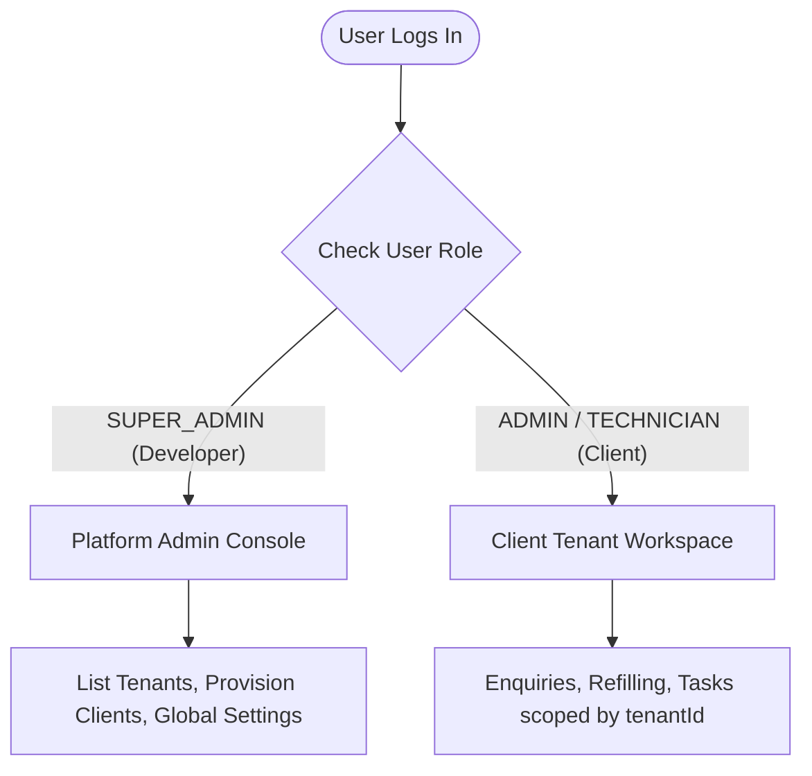
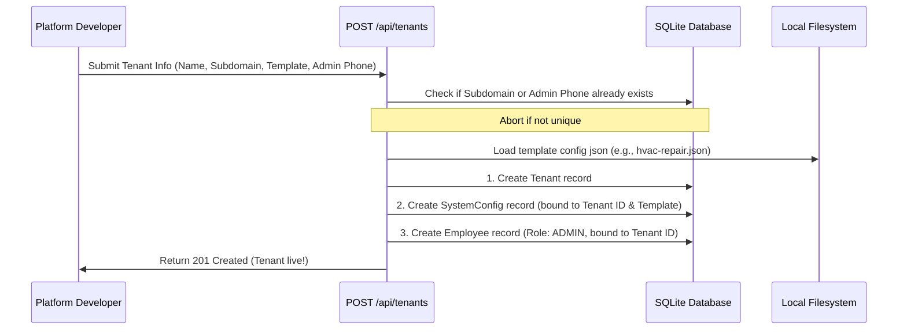

# Architecture Solution Guide: Centralized SaaS Platform Tenant Manager (Phase 5)

This guide documents the technical design, data boundaries, and routing logic for the centralized **Platform Tenant Manager Console** built for the platform developer (`SUPER_ADMIN`).

---

## 1. Context Separation Architecture

The application operates in two distinct contexts determined by the logged-in user's role:



### Role Boundaries
* **Client Tenant Context (`ADMIN` / `TECHNICIAN`)**:
  - Bound strictly to a single `tenantId` in the database.
  - Queries are isolated using `{ where: { tenantId } }` clauses.
  - Access is restricted to client dashboards (`/admin/enquiry`, `/admin/refilling`, etc.).
* **Platform Console Context (`SUPER_ADMIN`)**:
  - Global developer account with `tenantId: null`.
  - Allowed to query across all tenants (e.g. counting total tickets, listing tenant records).
  - Swaps menus from client-centric lists to the platform-wide manager (`/admin/tenants`).

---

## 2. Dynamic Configuration Targeting
To allow a central administrator to edit settings for any client, the config endpoints (`/api/config`) and views are modified to accept a `tenantId` query parameter.

```
Request: GET /api/config?tenantId=4b75d825-b974-4668-910c-4d4e40faf5ae
```

### Authorization Rule
- If the session role is `"SUPER_ADMIN"`, the API will load/save config matching the requested `?tenantId=...`.
- If the session role is `"ADMIN"`, the API ignores the query parameter and strictly scopes settings modifications to the user's own `tenantId` from their cookie token.

---

## 3. Automated Provisioning Pipeline Flow

When the developer provisions a new tenant, the system executes a transactional pipeline to guarantee atomic deployment:



---

## 4. UI Layout Routing Restructure

* **Menu Navigation filtering (`src/app/admin/layout.tsx`)**:
  - On mount, if the user role is `SUPER_ADMIN`, we bypass rendering client-level menus (Enquiries, Refilling, Services, Employees).
  - The menu array is rebuilt to show:
    - **Tenant Manager** (`/admin/tenants`)
    - **Platform Defaults** (`/admin/settings`)
    - **Technician Sandbox** (`/admin/sandbox/dashboard/ENQUIRY`)
* **Redirection Gates (`src/app/page.tsx`)**:
  - Directs `SUPER_ADMIN` to `/admin/tenants` automatically upon successful login.
