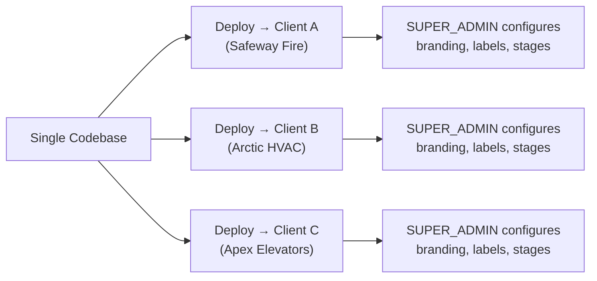
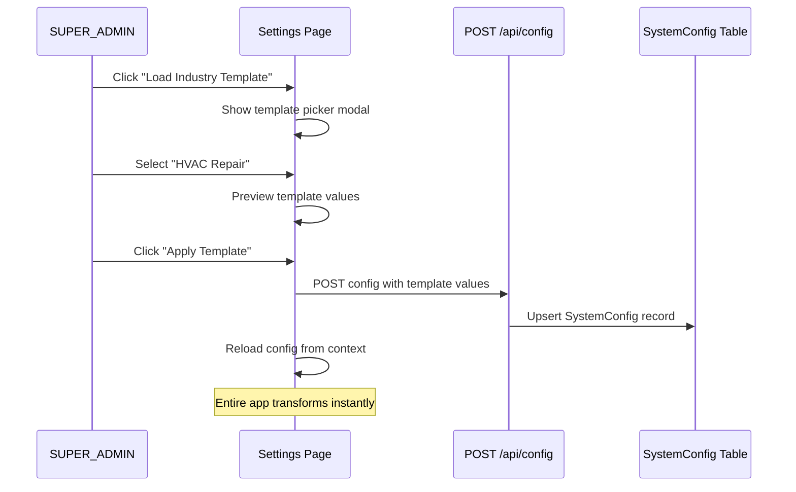

# Architecture Solution Guide: SUPER_ADMIN Configuration Control Center (Phase 5 — Revised)

This guide documents the **single-tenant deployment model** where each client gets their own hosted instance of the application, and the `SUPER_ADMIN` serves as a **no-code configuration control center** to customize the entire application for that specific client.

---

## 1. Deployment Model



### Key Principle
> **Zero code changes between clients.** The same codebase is deployed for every client. All differences (branding, vocabulary, stages, fields, categories) are controlled entirely through the SUPER_ADMIN Settings panel stored in the `SystemConfig` database table.

---

## 2. Role Separation

| Role | Purpose | Sees |
|------|---------|------|
| `SUPER_ADMIN` | Platform developer. Configures the instance for the client. | **Settings Control Center** (brand, stages, labels, fields, categories, CSV mappings, templates) |
| `ADMIN` | Client administrator. Manages daily operations. | Enquiry/Refilling/Services dashboards, Employee Master, Technician View |
| `TECHNICIAN` | Client field worker. Executes assigned tasks. | Task list, checklist forms |

### What changes for SUPER_ADMIN:
- ❌ Does **NOT** see client operational screens (Enquiry, Refilling, Services, Employees)
- ✅ Sees **Settings Control Center** as their primary workspace
- ✅ Sees **Technician Sandbox** to preview how configurations affect the field worker view
- ✅ Sees **Overview Center** as a read-only summary (using generic/dynamic labels)

---

## 3. Configuration Surface (What SUPER_ADMIN Controls)

Everything below is already stored in `SystemConfig.config` (JSON) and read dynamically at runtime:

### Already Implemented ✅
| Feature | Config Path | Settings Tab |
|---------|-------------|--------------|
| Company name & subtitle | `brand.title`, `brand.subtitle` | Brand |
| Logo URL | `brand.logoUrl` | Brand |
| Theme colors | `brand.theme.primaryColor`, `brand.theme.accentColor` | Brand |
| Dark/light mode | `brand.theme.darkTheme` | Brand |
| Field vocabulary labels | `brand.labels.*` (7 labels) | Brand |
| Enable/disable stages | `stages.ENQUIRY.enabled`, etc. | Stages |
| Stage display names | `stages.ENQUIRY.displayName`, etc. | Stages |
| Enquiry categories | `categories[]` | Categories |
| Enquiry sources | `sources[]` | Categories |
| Custom dynamic fields per stage | `stages.*.fields[]` | Fields |
| CSV import column mappings | `importMappings.*` | CSV |

### Needs Enhancement 🔧
| Feature | What's Missing |
|---------|---------------|
| **Industry Template Loader** | A "Load Template" button in Settings that lets SUPER_ADMIN pick a pre-built industry template (Fire Safety, HVAC, Elevator, IT Helpdesk) and auto-populate all config fields in one click |
| **Settings as landing page for SUPER_ADMIN** | Currently SUPER_ADMIN lands on the Overview Center. Should land directly on Settings |
| **SUPER_ADMIN sidebar menu** | Currently shows client menus. Should show only Settings + Sandbox + Overview |

---

## 4. Industry Template System

Templates are JSON files stored in `src/config/templates/`. Each template pre-fills the entire `EmsConfig` structure for a specific industry vertical.

### Current Templates
- `hvac-repair.json` — HVAC / Air Conditioning

### Templates to Add
- `fire-safety.json` — Fire Extinguisher (the current default, extracted from `EMS_CONFIG`)
- `elevator-maintenance.json` — Elevator / Lift maintenance
- `it-helpdesk.json` — IT support ticketing

### Template Loading Flow


---

## 5. Layout Routing Changes

### Current (before Phase 5)
```
SUPER_ADMIN sidebar:
  ├── Overview Center
  ├── Employee Master
  ├── Enquiry Dashboard        ← client-level, should be hidden
  ├── Refilling Dashboard      ← client-level, should be hidden
  ├── Services Dashboard       ← client-level, should be hidden
  ├── Technician View          ← client-level, should be hidden
  ├── System Settings
  └── Sandbox View (Dev)
```

### After Phase 5
```
SUPER_ADMIN sidebar:
  ├── Configuration Center     ← Settings page (landing page)
  ├── Overview Center          ← read-only, generic labels
  └── Technician Sandbox       ← preview field worker view
```

---

## 6. Files Affected

| File | Change |
|------|--------|
| `src/app/admin/layout.tsx` | Filter sidebar menu items for SUPER_ADMIN |
| `src/app/admin/settings/page.tsx` | Add "Load Industry Template" section with template picker |
| `src/app/page.tsx` | Redirect SUPER_ADMIN to `/admin/settings` after login |
| `src/config/templates/fire-safety.json` | [NEW] Extract current defaults into template file |
| `src/config/templates/elevator-maintenance.json` | [NEW] Elevator industry template |
| `src/config/templates/it-helpdesk.json` | [NEW] IT support template |
